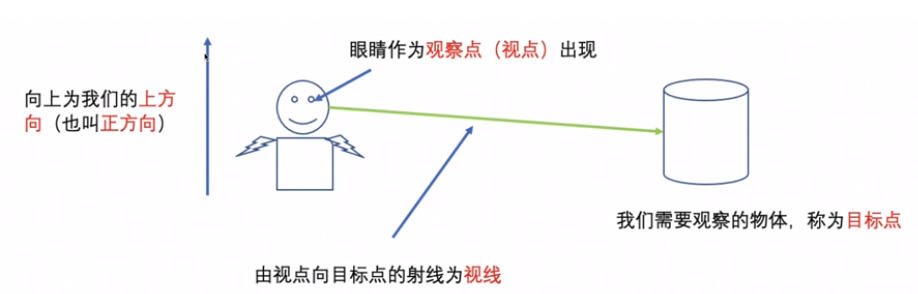

# 3D理论

## 视点、目标点、上方向



## 观察平面


## 辅助函数

```javascript

/** 归一化函数  归一到0-1的区间内 */
function normalize(arr) {
  let sum = 0;
  for (let i = 0; i < arr.length; i++) {
    sum += arr[i] * arr[i];
  }
  const middle = Math.sqrt(sum);
  for (let i = 0; i < arr.length; i++) {
    arr[i] /= middle;
  }
}

/** 叉积函数 求2个平面的法向量 */
function cross(v1, v2) {
  return new Float32Array([
    v1[1] * v2[2] - v1[2] * v2[1],
    v1[2] * v2[0] - v1[0] * v2[2],
    v1[0] * v2[1] - v1[1] * v2[0]
  ]);
}

/** 点积函数 求某点在x,y,z轴上的投影长度 */
function dot(v1, v2) {
  return v1[0] * v2[0] + v1[1] * v2[1] + v1[2] * v2[2];
}


/** 向量差 获取视点到目标点之间的向量 */
function minus(v1, v2) {
  return new Float32Array([
    v1[0] - v2[0],
    v1[1] - v2[1],
    v1[2] - v2[2]
  ]);
}

/** 视图矩阵获取 */
function getViewMatrix(eyex, eyey, eyez, lookAtx, lookAty, lookAtz, upx, upy, upz) {
  // 视点
  var eye = new Float32Array([eyex, eyey, eyez]);
  // 目标点
  var lookAt = new Float32Array([lookAtx, lookAty, lookAtz]);
  // 上方向
  var up = new Float32Array([upx, upy, upz]);
  // 观察平面
  var z = minus(eye, lookAt);

  normalize(z)
  normalize(up)
  var x = cross(up, z);

  normalize(x)
  var y = cross(z, x);

  // 视图矩阵
  var viewMatrix = new Float32Array([
    x[0], y[0], z[0], 0,
    x[1], y[1], z[1], 0,
    x[2], y[2], z[2], 0,
    -dot(x, eye), -dot(y, eye), -dot(z, eye), 1
  ]);
  return viewMatrix;
}

```


投影

- 正射投影
- 透视投影


